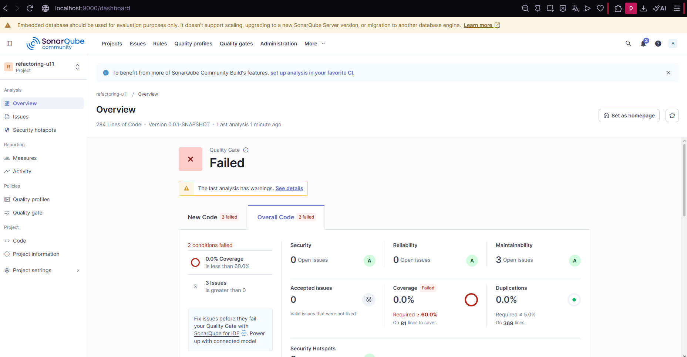
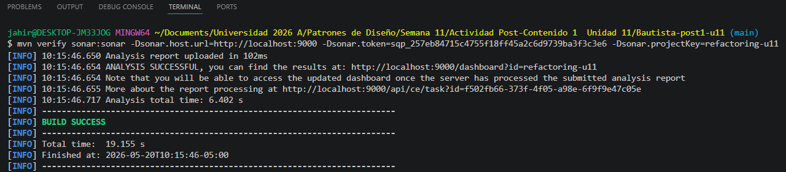

# Bautista-post1-u11
Actividad Post-Contenido 1 / Unidad 11

# Pedido Service — Análisis SonarQube

# Refactorización Avanzada — Unidad 11

## Objetivo

Identificar y eliminar code smells de tipo:

* Long Method
* Large Class
* Primitive Obsession

Aplicando técnicas de refactorización:

* Extract Method
* Extract Class
* Introducción de Value Objects

Usando SonarQube para medir la mejora de mantenibilidad y reducción de complejidad ciclomatica.

---

# Tecnologías usadas

* Java 21
* Spring Boot 3
* Maven
* SonarQube
* H2 Database

---

# Paso 1 — Código inicial con Code Smells

Se creó un servicio `PedidoService` con problemas deliberados:

* Long Method
* Primitive Obsession
* Large Class
* Field Injection

## Métricas iniciales SonarQube

| Métrica         | Valor |
| --------------- | ----- |
| Coverage        | 0.0%  |
| Code Smells     | 5     |
| Reliability     | C     |
| Maintainability | A     |
| Duplications    | 0.0%  |

## Problemas detectados

* Método `procesarPedido()` demasiado largo
* Exceso de parámetros primitivos
* Responsabilidades mezcladas
* Inyección por campo usando `@Autowired`

---

# Paso 2 — Introducción de Value Objects

Se creó:

* `DatosCliente`
* `Direccion`

Para eliminar Primitive Obsession y Data Clumps.

## Mejoras

* Encapsulamiento
* Validación centralizada
* Inmutabilidad
* Código más mantenible

---

# Paso 3 — Extract Method

Se dividió `procesarPedido()` en métodos pequeños:

* `calcularTotal()`
* `aplicarDescuento()`
* `persistirPedido()`

## Resultado

Reducción de complejidad ciclomatica y mejor legibilidad.

---

# Paso 4 — Extract Class

Se extrajo la responsabilidad de notificación hacia:

* `NotificacionService`

También se reemplazó:

* `@Autowired`

por:

* Constructor Injection

## Beneficios

* Mejor cohesión
* Menor acoplamiento
* Responsabilidad única

---

# Comparación de métricas

| Métrica                 | Antes | Después   |
| ----------------------- | ----- | --------- |
| Code Smells             | 5     | Reducidos |
| Complejidad Ciclomática | Alta  | 1-2       |
| Primitive Obsession     | Sí    | Eliminado |
| Long Method             | Sí    | Eliminado |
| Large Class             | Sí    | Reducido  |

---

# Verificaciones realizadas

* Proyecto compila correctamente
* DatosCliente es inmutable
* procesarPedido() reducido
* NotificacionService separado
* Constructor Injection aplicado
* SonarQube reporta menos smells

---

# Commits realizados

1. Código inicial con smells
2. Introducción de Value Objects y Extract Method
3. Extract Class y segundo análisis SonarQube

---

# Evidencias

Agregar capturas del dashboard de SonarQube:

